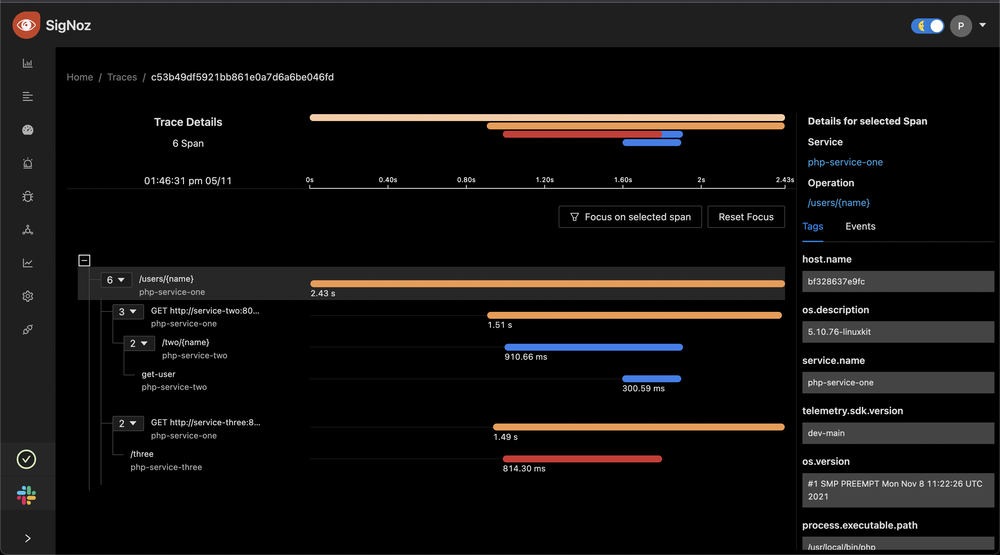
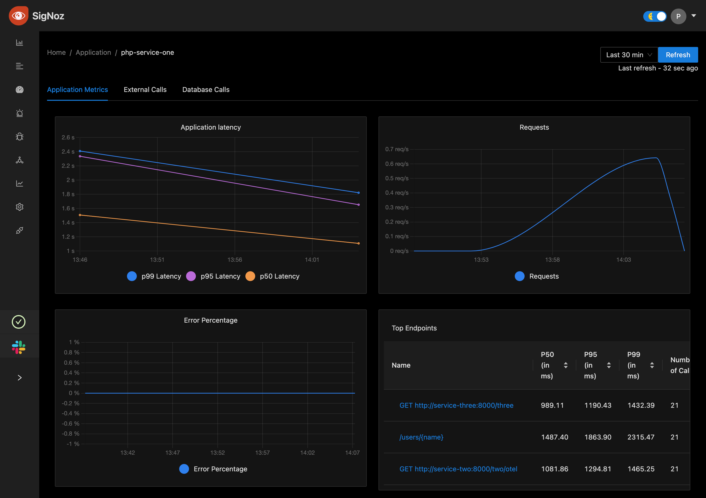

# Sample PHP App

Sample includes various types of examples:
1. [Getting started - console exporter]()
2. [Send trace to collector]()
3. [Distributed Tracing]()

### How to run simple examples 🏃‍♀️

```sh
# at the root of the dir run
composer install

# cd into the src
php 1-getting-started-console-exporter.php
```

## Distributed Tracing

### Running Distributed tracing example

```sh
# navigate to the /src/distributed-tracing
cd ./src/distributed-tracing

docker-compose run service-one composer install
docker-compose up

# in a separate terminal
$ curl localhost:8000/users/otel

```

#### Trace visualization on SigNoz



#### Application Metrics


